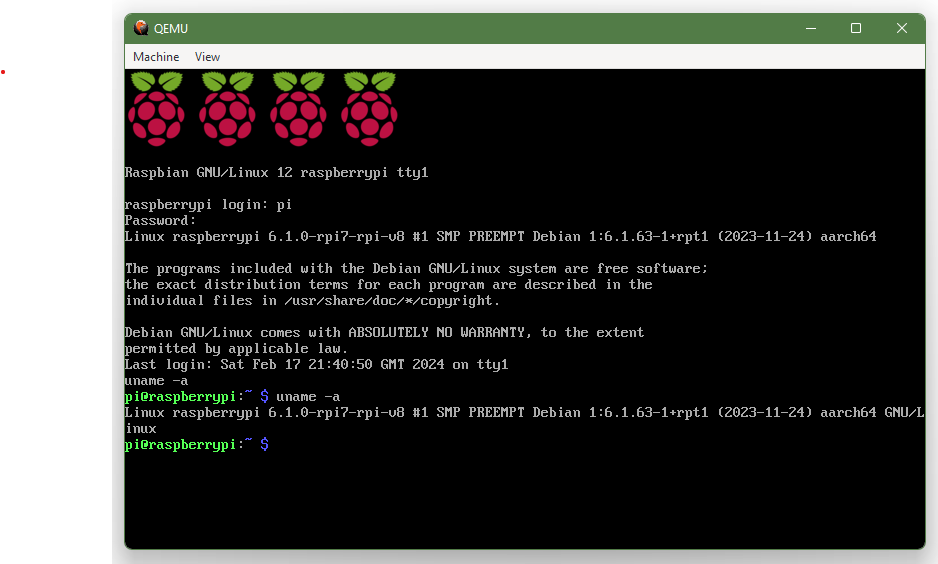

# RasPiOS ARM64 Emulation Scripts

This repository contains scripts for automating setup of arm64 emulation of RasPiOS using QEMU. Emulating arm64 architecture is useful for testing and development on systems that do not natively support the ARM architecture.

## Prerequisites

- [QEMU](https://www.qemu.org/) installed on your system, and available in PATH
- [Docker]() if on Windows


## Setup
1. Clone this repository to your local machine:

   ```bash
   git clone https://github.com/andrewiankidd/pi-emu.git
   ```

## Usage

1. Run the emulation script:

    **Linux**
   ```bash title="Linux"
   ./emulator/run.sh
   ```
    **Windows**
    ```bash
   ./emulator/run.ps1
   ```

   This script has some predefined RasPiOS releases, with a current default value of bookworm.
    | Image    | Boot Status |
    | -------- | ------- |
    | 2021-05-07-raspios-buster-armhf-lite | ❌ |
    | 2023-05-03-raspios-bullseye-armhf-lite | ✅ |
    | 2023-12-11-raspios-bookworm-armhf-lite | ✅ |

   If the image doesn't exist locally, it will be downloaded and 'built' into an QEMU friendly format.

   This script then executes QEMU with the necessary parameters to emulate the RasPiOS image, with arm64 architecture.

## Configuration

TODO

## Contributing

If you find issues or have suggestions for improvements, feel free to open an [issue](https://github.com/andrewiankidd/pi-emu/issues) or submit a [pull request](https://github.com/andrewiankidd/pi-emu/pulls).

## License

N/A

